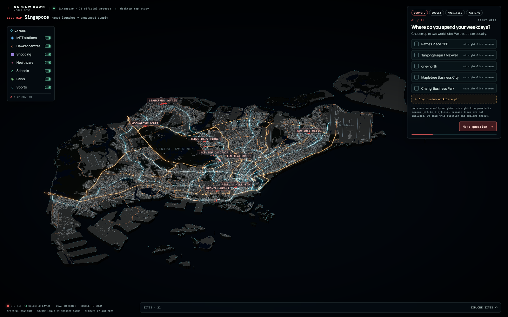

# Where To BTO

An interactive desktop map for narrowing Singapore BTO projects by commute, budget, nearby amenities, and estimated waiting time. Projects begin equally visible and dim only when they miss criteria the visitor has answered—there is no hidden composite ranking.



## What it includes

- 22 launched or officially announced BTO records from the dated project snapshot (November 2026 project facts stay "Not published by HDB yet" until HDB publishes them)
- A real-geography miniature Singapore assembled from 118,415 building footprints
- MRT/LRT, major roads, water, greenery, runways, planning areas, and orientation landmarks
- Four transparent narrowing criteria with `pass`, `miss`, `unknown`, and unanswered states; each confirmed miss dims a project by exactly 23 percentage points (100/77/54/31/8 %)
- Results grouped without ranking: fits all criteria, could fit (awaiting published data), has trade-offs
- Five amenity groups (MRT, Food & shopping, Healthcare, Schools, Parks & recreation) over the seven official amenity types, with one shared accessible palette
- Amenity detail views with 32 locally optimised, fully credited open-licence photos and honest no-photo states for the remaining 21 records (`data/amenity-media.json`)
- A selected-project fly-to view with an approximate 1 km context ring and curated amenities
- A software-renderer lite path for headless browsers and lower-capability environments
- A crawlable information layer: 22 static project pages, project directory, FAQ, six decision guides (including a Start Here walkthrough), methodology/source register, and canonical AI-information page
- Route-specific titles, descriptions, canonicals and JSON-LD, plus generated `sitemap.xml`, `robots.txt`, web manifest, and site icon

This is a location-exploration prototype, not financial, eligibility, routing, or application advice. Project facts can become stale; follow the linked official HDB sources before making a decision.

## Run locally

Requirements: Node.js 20+ and npm.

```bash
npm ci
npm run dev
```

Open <http://localhost:3000>.

Production metadata uses `NEXT_PUBLIC_SITE_URL` when set, then Vercel's stable production hostname variables. This avoids hardcoding a guessed deployment URL; set `NEXT_PUBLIC_SITE_URL` when a custom domain becomes canonical.

## Verification

```bash
npm run lint
npm run test
npm run build
npm run test:e2e
```

The map asset contract is also covered by tests: processed asset size, geometry sanity, transport classes, station coverage, and the absence of raw GeoJSON in `public/map/`.

SEO integrity tests cover unique project slugs, complete sitemap inclusion, substantive FAQ copy, canonical metadata, structured data, visible official-source sections, and crawl access. The content routes are statically generated; important project facts are available as semantic HTML rather than only inside the Three.js canvas.

## Map data and regeneration

The browser loads compact processed files from `public/map/`; it does not fetch a live map API or ship the raw source extracts.

```bash
npm run map:build
```

Regeneration expects locally downloaded inputs under `work/geo-raw/`. That directory is intentionally ignored because the raw extracts are large. See the header of `scripts/build-map-assets.ts` for the required source files and queries.

Map sources and retrieval dates are recorded in `public/map/manifest.json`:

- URA Master Plan 2019 Subzone Boundary (No Sea), under the Singapore Open Data Licence
- OpenStreetMap via Overpass, © OpenStreetMap contributors, under ODbL 1.0

Where OSM provides `height` or `building:levels`, those tags drive the miniature. Other building heights are deterministic visual approximations by footprint, type, and planning area; they are not survey data. Project and amenity records remain separate from this visual context and keep their own official-source metadata.

## Typography and media

The interface uses Hanken Grotesk only (SIL OFL 1.1; files and licence in `app/fonts/`), self-hosted via `next/font/local`. Amenity photographs are downloaded and optimised by `npm run media:build` from the curated picks in `work/amenity-media/picks.json`; every shipped image carries its creator, licence, and source page in `data/amenity-media.json`, which is deliberately separate from the official data snapshot.

## Stack

Next.js App Router, TypeScript, React 19, React Three Fiber, Three.js, Vitest, and Playwright.

The package remains marked `private` to prevent accidental npm publication. No separate software licence is granted by this repository; the source-data licences above continue to apply to their respective data.
